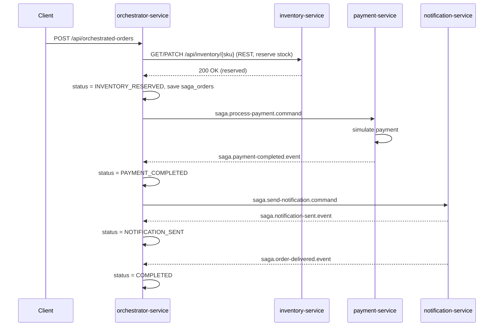
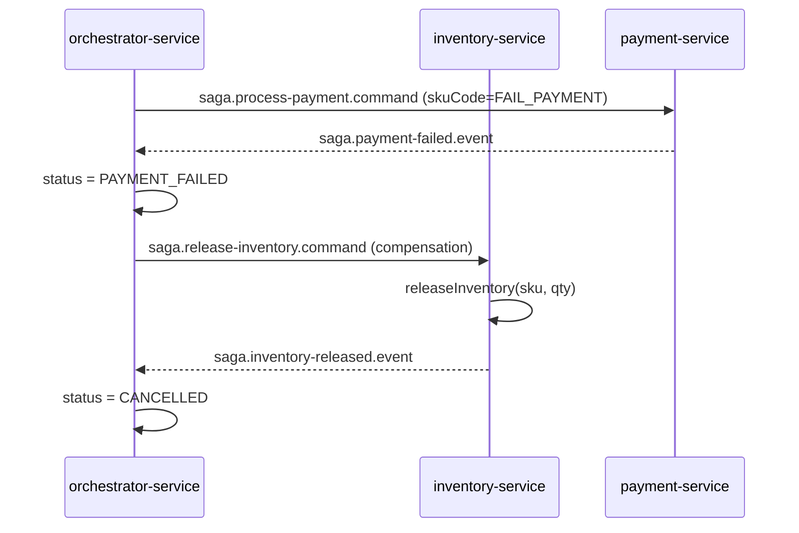

# OMS POC — Saga Orchestration Add-on

This package adds a **saga orchestration** implementation on top of your existing
**saga choreography** OMS POC (order-service, inventory-service, payment-service,
notification-service, Kong, security-utils), without modifying a single existing
file. It was generated by reading your actual uploaded project (packages, DTOs,
event names, topic names, ports, DB names) so naming matches exactly.

## Why this approach (given the time crunch)

Real orchestration means a central coordinator explicitly *commands* each service
and reacts to its replies, instead of services autonomously reacting to each
other's domain events (that's choreography, which is what you already have).

To get you a working orchestrator with near-zero risk to your already-working
demo:

- A **new `orchestrator-service`** (new Spring Boot app, port `8085`) is the
  central coordinator. It owns its own saga state table (`saga_orders`) so you
  can see the saga progress step-by-step.
- Three **small, purely additive files** are dropped into
  `payment-service`, `inventory-service`, `notification-service` — new
  packages (`...saga`), new Kafka topics (`saga.*`), new consumer groups.
  **Nothing existing is edited, renamed, or removed.** Your current
  choreography demo keeps working exactly as it does today, on the exact same
  topics (`order-created-topic`, `payment-completed-topic`, etc).
- Orchestration runs on a **completely separate set of Kafka topics**
  (`saga.*`) so the two flows can never cross-fire into each other.

This means: if orchestration doesn't work for some reason, your choreography
demo is completely unaffected — you always have a working fallback.

## 1. What to import

```
orchestrator-service/                     <- NEW standalone Spring Boot project. Import as its own Maven project.
existing-service-additions/
  payment-service-additions/src/...       <- copy this src/ tree INTO your existing payment-service/ (merge)
  inventory-service-additions/src/...     <- copy this src/ tree INTO your existing inventory-service/ (merge)
  notification-service-additions/src/...  <- copy this src/ tree INTO your existing notification-service/ (merge)
```

Concretely:

```bash
# from wherever you unzipped this delivery
cp -r existing-service-additions/payment-service-additions/src/main/java/com/ikea/oms/paymentservice/saga \
      <your-oms-poc>/payment-service/src/main/java/com/ikea/oms/paymentservice/

cp -r existing-service-additions/inventory-service-additions/src/main/java/com/ikea/oms/inventoryservice/saga \
      <your-oms-poc>/inventory-service/src/main/java/com/ikea/oms/inventoryservice/

cp -r existing-service-additions/notification-service-additions/src/main/java/com/ikea/oms/notificationservice/saga \
      <your-oms-poc>/notification-service/src/main/java/com/ikea/oms/notificationservice/
```

Each is a brand-new `saga` sub-package — nothing to merge/conflict, just drop
the folder in. No existing `.java` file is touched.

`orchestrator-service` is imported as a **4th independent Maven project**,
exactly like your other 4 services (own `pom.xml`, own `application.properties`).

## 2. Database setup

`orchestrator-service` uses its own database on the same local Postgres
instance your other services already use (`localhost:5432`,
`postgres`/`postgres`):

```sql
CREATE DATABASE orchestratordb;
```

`spring.jpa.hibernate.ddl-auto=update` will create the `saga_orders` table
automatically on first boot — same pattern as order-service/inventory-service.

## 3. Run order

1. Postgres running, `orchestratordb` created (step 2)
2. Kafka running on `localhost:9092` (whatever you already use for the
   choreography demo)
3. `inventory-service` (`8081`) — orchestrator calls its REST API directly
4. `payment-service` (`8084`)
5. `notification-service` (`8083`)
6. `orchestrator-service` (`8085`)
7. (optional) `order-service` (`8082`) and Kong if you also want to demo
   choreography side-by-side — fully independent of the above

## 4. Kafka topic map

| Step | Choreography (existing, unchanged) | Orchestration (new) |
|---|---|---|
| Trigger payment | `order-created-topic` (payment-service reacts on its own) | `saga.process-payment.command` (orchestrator tells payment-service to act) |
| Payment success | `payment-completed-topic` | `saga.payment-completed.event` |
| Payment failure | `payment-failed-topic` | `saga.payment-failed.event` |
| Trigger notification | *(implicit — notification-service reacts to `payment-completed-topic`)* | `saga.send-notification.command` (orchestrator explicitly tells it to act) |
| Notification sent | `notification-sent-topic` | `saga.notification-sent.event` |
| Order delivered | `order-delivered-topic` | `saga.order-delivered.event` |
| Trigger compensation | *(implicit — inventory-service reacts to `payment-failed-topic`)* | `saga.release-inventory.command` (orchestrator explicitly tells it to compensate) |
| Compensation done | `inventory-released-topic` | `saga.inventory-released.event` |

Consumer groups used by the new orchestration listeners:
`orchestrator-group`, `payment-orchestration-group`,
`inventory-orchestration-group`, `notification-orchestration-group` — all
distinct from the existing `order-group-v2`, `inventory-group`,
`payment-group`, `notification-group`.

## 5. Sequence diagram — happy path



## 6. Sequence diagram — compensation path



## 7. Testing guide

### Success scenario

```bash
curl -X POST http://localhost:8085/api/orchestrated-orders \
  -H "Content-Type: application/json" \
  -d '{
    "skuCode": "SKU-001",
    "quantity": 2,
    "customerName": "Jane Doe",
    "customerEmail": "jane@example.com",
    "shippingAddress": "123 Main St"
  }'
```

Note the `orderNumber` returned (e.g. `SAGA1751...`), then poll:

```bash
curl http://localhost:8085/api/orchestrated-orders/SAGA1751...
```

Expected status progression:
`STARTED` → `INVENTORY_RESERVED` → `PAYMENT_PROCESSING` → `PAYMENT_COMPLETED`
→ `NOTIFICATION_PROCESSING` → `NOTIFICATION_SENT` → `COMPLETED`

### Failure / compensation scenario

Same as your existing choreography test trick — use `FAIL_PAYMENT` as the SKU
(make sure an inventory row with `skuCode = FAIL_PAYMENT` exists, same as you
already seeded for the choreography demo):

```bash
curl -X POST http://localhost:8085/api/orchestrated-orders \
  -H "Content-Type: application/json" \
  -d '{
    "skuCode": "FAIL_PAYMENT",
    "quantity": 1,
    "customerName": "John Smith",
    "customerEmail": "john@example.com",
    "shippingAddress": "456 Oak Ave"
  }'
```

Expected status progression:
`STARTED` → `INVENTORY_RESERVED` → `PAYMENT_PROCESSING` → `PAYMENT_FAILED`
→ `COMPENSATING` → `CANCELLED`

### List all sagas

```bash
curl http://localhost:8085/api/orchestrated-orders
```

## 8. Kong

Your uploaded project's `kong/` folder only contains the Kong
`docker-compose.yml` (DB-backed Kong 3.7, proxy on `8000`, admin API on
`8001`). The actual routes/services/plugins (JWT, API key, ACL, rate
limiting) weren't in a declarative file in the zip, so they were set up
via Admin API calls that aren't in this package — I can't safely guess
those. To route the orchestrator through Kong the same way you likely did
for the other services, register it via the Admin API, e.g.:

```bash
curl -i -X POST http://localhost:8001/services \
  --data name=orchestrator-service \
  --data url=http://host.docker.internal:8085

curl -i -X POST http://localhost:8001/services/orchestrator-service/routes \
  --data 'paths[]=/api/orchestrated-orders'
```

Then re-apply whatever plugins (JWT/API key/ACL/rate-limiting) you attached
to your other routes, the same way you originally configured them.

## 9. Why status transitions are visible

Every state change is persisted to `saga_orders` (`status`, `currentStep`,
`failureReason`, timestamps) specifically so you can explain, in an
interview, exactly which step the saga is at and why — this is the
"traceability" that choreography lacks without extra tooling. That table is
the orchestrator's source of truth and only the orchestrator writes to it.
